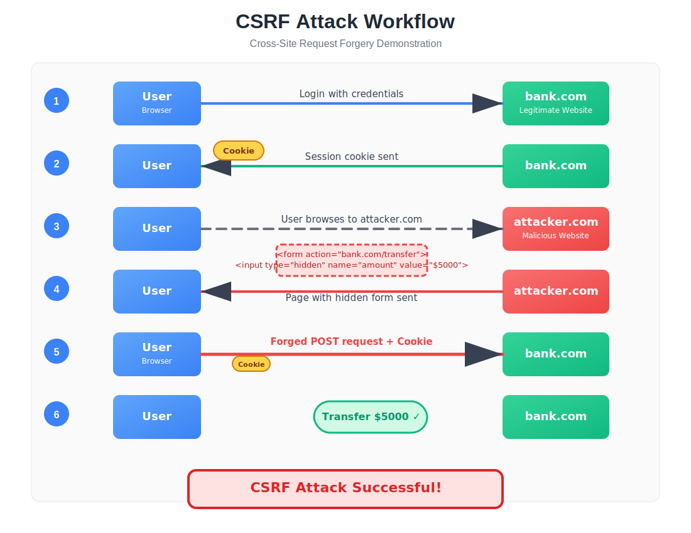

# CSRF Vulnerability Lab

A comprehensive educational lab for demonstrating Cross-Site Request Forgery (CSRF) vulnerabilities and protections in web applications.

## Table of Contents

- [What is CSRF?](#what-is-csrf)
- [How CSRF Works](#how-csrf-works)
- [How to Exploit CSRF](#how-to-exploit-csrf)
- [Lab Details](#lab-details)
  - [Installation](#installation)
- [Lab Walkthrough](#lab-walkthrough)
- [How to Mitigate CSRF](#how-to-mitigate-csrf)
- [Screenshots](#screenshots)
- [Contributing](#contributing)
- [License](#license)

## What is CSRF?

Cross-Site Request Forgery (CSRF) is a type of web security vulnerability that allows an attacker to trick authenticated users into performing unwanted actions on a website where they're currently logged in. Unlike XSS (Cross-Site Scripting) which exploits the trust a user has in a particular site, CSRF exploits the trust that a website has in a user's browser.



Key characteristics of CSRF attacks:

- They target state-changing requests (not data theft)
- They exploit the authentication mechanism of the target site
- They rely on the user being authenticated on the target site
- They force the victim's browser to generate requests to the vulnerable application

Real-world impact of CSRF attacks:
- Changing account details (email, password)
- Making financial transactions
- Posting content under the victim's identity
- Administrative actions (if the victim is an admin)

## How CSRF Works

CSRF attacks work through a specific sequence of events:

1. **Authentication**: The victim logs into a vulnerable website (e.g., a banking site) and receives a session cookie.

2. **Session Maintenance**: The victim keeps the session active by not logging out or closing the browser.

3. **Malicious Link/Site**: The victim is tricked into visiting a malicious website or clicking a malicious link while still authenticated to the vulnerable site.

4. **Forged Request**: The malicious site contains code that automatically sends a request to the vulnerable site.

5. **Cookie Inclusion**: The browser automatically includes the victim's session cookies with the request.

6. **Request Processing**: The vulnerable site processes the request as legitimate because it contains valid session cookies.

7. **Action Execution**: The vulnerable site executes the action (e.g., changing email, transferring funds) without the victim's knowledge or consent.

The key technical aspects that make CSRF possible:

- Browsers automatically include cookies for a domain with any request to that domain
- Websites often rely solely on cookies to identify authenticated users
- HTTP requests can be initiated from different origins (websites)

## How to Exploit CSRF

Exploiting a CSRF vulnerability typically involves these steps:

1. **Identify a Vulnerable Endpoint**: Find a state-changing function on the target website that:
   - Relies only on cookies for authentication
   - Doesn't implement CSRF protections
   - Performs a valuable action (e.g., changing account settings)

2. **Analyze the Request**: Determine what parameters are needed to perform the action:
   - HTTP method (GET, POST)
   - Required parameters and their values
   - Any specific headers or cookies needed

3. **Create the Attack Payload**: Develop HTML/JavaScript code that will automatically send the forged request:
   - For GET requests: ``
   - For POST requests: Create an auto-submitting form

4. **Deliver the Payload**: Get the victim to execute the payload through:
   - Sending a link via email/message
   - Hosting the payload on a website the victim might visit
   - Embedding the payload in a popular website through other vulnerabilities

5. **Execution**: When the victim loads the page with the payload, their browser automatically sends the request to the vulnerable site with their cookies attached.

Example of a basic CSRF payload (as demonstrated in this lab):

```html
<form id="csrf-form" action="https://vulnerable-site.com/profile" method="post">
    <input type="hidden" name="email" value="hacked@attacker.com">
</form>
<script>
    document.getElementById("csrf-form").submit();
</script>
```

## Lab Details

This lab provides a hands-on environment to understand, identify, and exploit CSRF vulnerabilities through a simple web application with intentional CSRF vulnerabilities.

### Features

- Complete web application with user registration, login, and profile management
- Intentionally vulnerable profile update functionality
- Educational content explaining CSRF concepts
- Modern UI with animations and visual feedback
- Docker support for easy deployment

### Deployment

1. **Login to your poridhi account & Clone the repository**:
   ```bash
   git clone https://github.com/ahamedislam/csrf_lab.git
   cd csrf_lab
   ```

2. **Start the containers**:
   ```bash
   docker-compose up --build -d
   ```

   

3. **Figure out the ip address of the machine**:
   ```bash
   ifconfig
   ```
   

4. **Create a Load Balancer with the ip & port 8999**:
   
   

2. **Access the application by checking the load balancer**:

   


## Lab Walkthrough

### Step 1: Explore the Application

1. **Register a new account** using the registration form
2. **Log in** with your credentials
3. **Explore the dashboard** to see your account information
4. **Update your profile** to see how the form works normally

### Step 2: Understand the Vulnerability

The profile update form is vulnerable because:
- It doesn't implement any CSRF tokens
- It processes form submissions without verifying the origin
- It relies solely on session cookies for authentication

### Step 3: Exploit the Vulnerability

1. **Open the CSRF demo page** (`csrf_demo.html`) in another browser tab. There's a intentional mistake in the form action. Can you identify it & fix it?
2. **Examine the HTML source** to understand how the attack is constructed
3. **Click the button** on the demo page to trigger the CSRF attack
4. **Return to your dashboard** and notice your email has been changed without your explicit consent

### Step 4: Analyze the Attack

The attack succeeded because:
- You were authenticated to the application
- The application didn't verify the origin of the request
- The browser automatically included your session cookies with the request
- The application processed the request as legitimate

## How to Mitigate CSRF

### 1. Implement CSRF Tokens

The most effective protection is to include a unique, unpredictable token with each form:

```php
// Generate a token and store it in the session
$_SESSION['csrf_token'] = bin2hex(random_bytes(32));

// Include the token in the form
<input type="hidden" name="csrf_token" value="<?php echo $_SESSION['csrf_token']; ?>">

// Verify the token on form submission
if(!isset($_POST['csrf_token']) || $_POST['csrf_token'] !== $_SESSION['csrf_token']) {
    die("CSRF attack detected!");
}
```

### 2. Use SameSite Cookie Attribute

Modern browsers support the SameSite attribute for cookies, which restricts when cookies are sent:

```
Set-Cookie: session=123; SameSite=Strict
```

- `SameSite=Strict`: Cookies are only sent in a first-party context
- `SameSite=Lax`: Cookies are sent when navigating to the site but not for cross-site requests
- `SameSite=None`: Cookies are sent in all contexts (must be used with Secure flag)

### 3. Implement Custom Request Headers

For AJAX requests, implement custom headers that cannot be set by cross-origin requests:

```javascript
fetch('/api/update-profile', {
    method: 'POST',
    headers: {
        'X-Requested-With': 'XMLHttpRequest',
        'Content-Type': 'application/json'
    },
    body: JSON.stringify(data)
});
```

### 4. Check Referer Header

Verify that the request is coming from your own website:

```php
$referer = $_SERVER['HTTP_REFERER'] ?? '';
$allowed_domain = 'example.com';

if (!$referer || parse_url($referer, PHP_URL_HOST) !== $allowed_domain) {
    die("CSRF attack detected!");
}
```

### 5. Require User Interaction

For sensitive operations, require additional user interaction:
- Re-authentication for sensitive actions
- CAPTCHA verification
- Confirmation steps

### 6. Use Double Submit Cookie Pattern

Set a cookie and include the same value in the form:

```php
// Set a cookie with a random token
setcookie('csrf_token', $token, [/* options */]);

// Include the same token in the form
<input type="hidden" name="csrf_token" value="<?php echo $token; ?>">

// Verify that the cookie and form values match
if($_COOKIE['csrf_token'] !== $_POST['csrf_token']) {
    die("CSRF attack detected!");
}
```

## Screenshots

Here are some screenshots of the CSRF lab in action:

<p>
  <br>
  <em>The home page explaining CSRF concepts</em>
</p>

<p>
  <br>
  <em>User dashboard showing account information</em>
</p>

<p>
  <br>
  <em>The vulnerable profile update form</em>
</p>

<p>
  <br>
  <em>The malicious page that performs the CSRF attack</em>
</p>

## Contributing

Contributions to improve this CSRF lab are welcome! Here are some ways you can contribute:

- Report bugs or issues
- Suggest new features or improvements
- Add more educational content
- Improve the UI/UX
- Add more examples of CSRF attacks and mitigations

To contribute:

1. Fork the repository
2. Create a new branch (`git checkout -b feature/your-feature`)
3. Make your changes
4. Commit your changes (`git commit -m 'Add some feature'`)
5. Push to the branch (`git push origin feature/your-feature`)
6. Open a Pull Request

## License

This project is licensed under the MIT License - see the LICENSE file for details.

```
MIT License

Copyright (c) 2023 CSRF Lab

Permission is hereby granted, free of charge, to any person obtaining a copy
of this software and associated documentation files (the "Software"), to deal
in the Software without restriction, including without limitation the rights
to use, copy, modify, merge, publish, distribute, sublicense, and/or sell
copies of the Software, and to permit persons to whom the Software is
furnished to do so, subject to the following conditions:

The above copyright notice and this permission notice shall be included in all
copies or substantial portions of the Software.

THE SOFTWARE IS PROVIDED "AS IS", WITHOUT WARRANTY OF ANY KIND, EXPRESS OR
IMPLIED, INCLUDING BUT NOT LIMITED TO THE WARRANTIES OF MERCHANTABILITY,
FITNESS FOR A PARTICULAR PURPOSE AND NONINFRINGEMENT. IN NO EVENT SHALL THE
AUTHORS OR COPYRIGHT HOLDERS BE LIABLE FOR ANY CLAIM, DAMAGES OR OTHER
LIABILITY, WHETHER IN AN ACTION OF CONTRACT, TORT OR OTHERWISE, ARISING FROM,
OUT OF OR IN CONNECTION WITH THE SOFTWARE OR THE USE OR OTHER DEALINGS IN THE
SOFTWARE.
```
